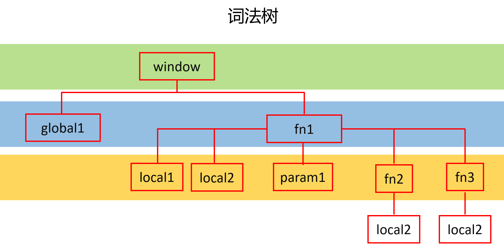

# 1. 函数声明
**函数有三种定义方式**
### 1.1 匿名函数
+ 直接引用会报错
```javascript
function () { 
    return 1;
}
```
+ 一般该该匿名一个引用
这函数存在堆内存中，把这个内存的地址赋值给`fn`，把`fn`赋值给`fn2`，就是把这个内存地址赋值给`fn2`

这个时候`fn.name`就是`fn`，`fn2.name`也是`fn`，因为他们是同一个函数

它是一个匿名函数，但是他有`name`

```javascript
var fn = function () {
    return 1;
}

var fn2 = fn;

```

### 1.2 具名函数
+ `fn3`的作用域在整个`window`对象里边，`fn3.name`为`fn3`
+ `fn4`的作用域只在`fn4`函数里边，调用`fn4`会报错
+ `fn5.name`为`fn4`


```javascript
function fn3 () {
    return 3;
}

var fn5 = function fn4 () {
    return 4;
}
```

### 1.3 箭头函数
+ 一个参数，直接写参数就可以
+ 如果有两个参数，需要把两个参数括起来
+ 如果返回的值不是一句话，那么就要用`{}`，然后`return`
+ 箭头函数的`name`与函数名相同

```javascript
var fn6 = i => i+1;

var fn7 = (x, y) => x + y;

var fn8 = (x, y) => {
    console.lof(x, y);
    return x + y;
}
```

# 2. 词法作用域

+ 浏览器看到这段代码，会把这段代码解析成抽象语法树`AST`
+ 就是把语法转成一棵树的形式，检测语法，语法正确之后，再从头开始执行。
+ 把下边的一段代码转成简化AST的形式


```javascript
var global1 = 1
function fn1(param1){
    var local1 = 'local1'
    var local2 = 'local2')
    function fn2(param2){
        var local2 = 'inner local2'
        console.log(local1)
        console.log(local2)
    }

    function fn3(){
        var local2 = 'fn3 local2'
        fn2(local2)
    }
}
```
+ 词法分析只分析词法树里的某一个变量是否是另外一个变量，不关心这两个变量的值是否相等

```javascript
var a = 1;
function b () {
    console.log(a);
}
// 在这里，b中的a一定是外边声明的a，但是a的值是多少，不能够确定，这个取决于在调用b之前，a的值是多少
```

```javascript
var a = 1;
function b () {
    console.log(a);
}

b();
// 在这里调用了函数b，那么就可以确定输出的值一定是1，如果在调用b之前把a的值修改为2，那么调用b的时候，输出的结果就是2

```

# 2. 词法作用域的延伸
+ [javascript的词法作用域](https://js8.in/2011/08/15/javascript的词法作用域/)
+ [静态作用域与动态作用域](https://zh.wikipedia.org/wiki/作用域#.E9.9D.99.E6.80.81.E4.BD.9C.E7.94.A8.E5.9F.9F.E4.B8.8E.E5.8A.A8.E6.80.81.E4.BD.9C.E7.94.A8.E5.9F.9F)
+ [Abstract Syntax Tree 抽象语法树简介](https://div.io/topic/1994)

# 3. call stack
+ 查看代码在栈运行的[在线网站](http://latentflip.com/loupe/?code=!!!PGJ1dHRvbj5DbGljayBtZSE8L2J1dHRvbj4%3D)
+ stack，栈，先进后出

+ 代码1，直接调用不同的函数

```javascript
function a() {
    console.log('a');
    return 'a';
}

function b() {
    console.log('b');
    return 'b';
}

function c() {
    console.log('c');
    return 'c';
}

a();
b();
c();
```

+ 代码2，嵌套调用函数

```javascript
function a() {
    console.log('a1');
    b();
    console.log('a2');
    return 'a';
}

function b() {
    console.log('b1');
    c();
    console.log('b2');
    return 'b';
}

function c() {
    console.log('c');
    return 'c';
}

a();
```

+ 代码3，递归

```javascript
function fab(n) {
  if (n >= 3) {
    return fab(n - 1) + fab(n - 2);
  } else {
    return 1;
  }
}
```

# 4. this & arguments
+ 每一个函数调用的时候，都需要传递一个`this`，如果不传递`this`，那么`this`就是`window`，如果不传`arguments`，那么`arguments`就是一个空数组
+ 如果想要明确`this`是谁，那么就使用`call()`，`call()`的第一个参数永远是`this`，不管有没有参数，而且这个`this`必须是对象，如果不是对象，那么将会自动改为对象格式。`person.sayHi.call(person)`
+ this是隐藏的第一个参数，且必须是对象
+ 如果不给参数，那么第一个参数就是`window`对象，`arguments`是伪数组
+ `call`的第一个参数如果不传，那么默认就是`window`对象，第二个及以后的所有参数都会成为一个数组里的元素作为`arguments`
+ 为什么使用`f.call()`而不是直接使用`f()`，是因为`f()`是`f.call()`的简化版
+ 如果不使用`call()`，那么就没有办法指定`this`，
+ 如果不确定参数的个数，那么就使用`apply`

```javascript
function f() {
  console.log(this, arguments);
}

c.call();
c.call({name: 'mark'});					// {name: 'mark'}
c.call({name: 'mark'}, 1);			// {name: 'mark', [1]}
c.call({name: 'mark'}, 1, 2);		// {name: 'mark', [1, 2]}
```
+ this为什么必须是对象？因为this就是函数对对象之间的羁绊

```javascript
f.call('hello', 1, 2);
// String {"hello"} Arguments [1, 2]

f.call(10, 1, 2);
// Number {10} Arguments [1, 2]

f.call(true, 1, 2);
// Boolean {true} Arguments [1, 2]
```
+ 关于function

在这里，`person.sayHi()`里，`this`指的是`person`，但是在`fn()`中，`this`指的是`window`。因为函数只有输入和输出，没有`this`的概念，函数的`this`取决于是谁调用它，如果是全局调用，那么`this`就是`window`，这个函数是某一个对象的属性，那么`this`就是这个对象，所以全局调用`fn()`实际上就是`window.fn()`

```javascript
var person = {
    name: 'mark',
    sayHi: function () {
      console.log(`hi, i am ${this.name}`);
    },
    sayBye: function () {
      console.log(`bye, i am ${this.name}`);
    },
    say: function (word) {
      console.log(`${word}, i am ${this.name}`);
    }
};

var fn = person.sayHi;
person.sayHi(); // this === person
fn();           // this === window
```

# 5. bind
+ `call`和`apply`都是直接调用函数，而`bind`则是返回一个新函数(并没有调用原来的函数)，这个新函数会`call`原来的函数，`call`的参数由你指定。
+ 每进入一层`function`，`this`都会改变`function`里的`this`就是`function`外层的函数

```javascript
var view = {
	element: 'div',
	bindEvents: function () {
		/************************** call start *****************************/
		var _this = this;
		this.element.onclick = function () { _this.onClick.call(_this); };
		/************************** call end   *****************************/

		/************************** bind start *****************************/
		this.element.onclick = this.onClick.bind(this);
		/************************** bind end   *****************************/

		/************************** this.bind start ************************/
		// bind会把bind前边的函数用函数再次包起来，然后在调用`this.onClick`的时候，使用`this.onClick.call()`
		// 此时的`this.onClick.call()`里缺少`this`，所以需要把`this`作为参数传递给`this.onClick.call()`，成为`this.onClick.call(this)`
		// 在这个时候，`bind`的`this`，就是最外层的`this`，所以`this.onClick.call(this)`里的`this`，就是最外层的`this`
		this.onClick.bind = function (x, y, z) {
			var oldFn = this;     // 这里的this就是外层的this.onClick
			return function () {
				oldFn.call(x, y, z);
			}
		};
		/************************** this.bind end   ************************/
	},
	onClick: function () {
		this.element.addClass('active');
	}
}
```

# 6. 柯里化/高阶函数
+ 返回函数的函数(惰性求值)
+ 柯里化: 将`f(x, y)`变成`f(x = 1)(y)`或者`f(y = 1)(x)`
+ 高阶函数: 在数学和计算机科学中，高阶函数是至少满足下列一个条件的函数
	+ 接受一个函数`map, reduce, filter, forEach`
	+ 输入一个函数`fn.bind.call(fn, {}, 1,2,3);`
	+ 输出一个函数(不过常常需要满足两个条件)

```
z = f(x, y) = x + 2y;
g = f(x = 1)(y) = 1 + 2y;
```

# 7. 回调函数
+ 回调指的是被当做参数的函数
+ 回调跟异步没有关系

# 8. 构造函数
+ 返回对象的函数就是构造函数
+ 一般首字母大写
+ 如果一个函数被另外一个值给`new`了，那么这个函数就是构造函数
+ 如果构造函数里没有返回值，默认返回`this`，使用的时候直接`new Empty()`即可
+ 如果构造函数里返回了`this`，那么使用的时候可以`var full = Full.call({});`


```javascript
function Empty() {}

var empty = new Empty();

function Full() {
	return this;
}

var full = Full.call({});
```

# 9. 箭头函数
+ 箭头函数没有`this`
+ 不接受`call`绑定然后修改`this`

```javascript
setTimeout(function (){
	console.log(this);
	setTimeout(function(){
		console.log(this);
	}, 1000)
}.bind({name:'mark'}), 1000);

setTimeout(function (){
	console.log(this);
	setTimeout(function(){
		console.log(this);
	}.bind(this), 1000)
}.bind({name:'mark'}), 1000);

setTimeout(function () {
	console.log(this);
	setTimeout(() => {
		console.log(this);
	})
}.bind({name: 'mark'}));
```


