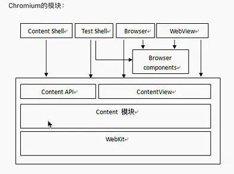

# 1. 平时浏览的页面是否是应用
+ 是应用

# 2. 在操作系统中的应用是如何运行的
+ 内核态和用户态

# 3. 浏览器是什么
+ 用户访问互联网最重要的一个接口
+ 本质上，浏览器是方便一般互联网用户通过界面解析和发送 HTTP 协议的软件
+ 用户代理 navigator.userAgent
	+ 判断浏览器类型，采用兼容方案
	+ 判断是否是移动端
	+ 标识 H5 容器，方便调用 H5 容器特定接口
	+ 注意 userAgent 伪装成本很低，不要过于依赖
	
# 4. webkit和浏览器的关系
## 4.1 内核
+ 对于操作系统来说， **内核** 是操作系统的核心，是第一层基于硬件的软件扩充，提供最核心最基础的服务。
+ 应用程序通过内核进行 **系统调用** 来使用计算机硬件，内核代码简洁高效，并且基本没有什么 bug ，由于是最底层的服务，一点微小的错误也会造成整个系统的崩溃。好处是基于一个稳定的内核，开发者可以构建适合不同场景的操作系统和应用软件。
+ 对于浏览器来说，同样存在 **浏览器内核** ，与操作系统内核相似，浏览器内核需要提供 API 给浏览器开发者使用，同时提供最核心的功能，如加载和渲染页面，调用操作系统所提供的服务。
+ 对于浏览器厂商来说，高效使用和开发浏览器内核是核心问题。对于 web 开发者来说，理解浏览器内核的基本机制，开发开发出高性能的 web 应用。
+ 负责将表示页面的字符转变成可视化的模块就是浏览器的内核。

## 4.2 Chromium 架构
### 4.2.1 问题
+ 除去 webkit 内核完成的功能，浏览器的工作有哪些？
	+ 资源管理
  + 多页面管理，就是多个标签页的管理
  + 插件和扩展
  + 账户和同步
  + 安全机制
  + 多系统支持
+ 进程和线程是什么？
	+ 进程是对 CPU ，主存，IO设备的抽象，操作系统对一个正在运行的程序的抽象。
	+ 线程是构成进程的执行单元。
	+ 进程通信(IPC)是进程间传输数据（交换信息）

### 4.2.2 Chromium 的多进程架构
	
+ Chromium 的多进程架构
	+ Browser 进程介绍，主进程，负责浏览器交界面，页面管理等
	+ Renderer 进程，渲染进程
	+ NPAPI 插件进程
	+ GPU 进程，当 GPU 硬件加速打开时会常见
+ 多进程架构的目的
	+ 职责分离，故障范围小
	+ 隔离性
	+ 性能

# 5. 浏览器是如何呈现页面的
## 5.1 网页内容的组成
+ doctype 提供浏览器 html 版本信息
+ head 是 html 的头部
	+ meta 元数据信息
		+ charset 此特性声明当前文档所使用的字符编码
		+ http-equiv 客户端行为，如渲染模式，缓存等
		+ `name[keywords]` 搜索引擎使用
		+ `name[description]` 搜索引擎使用
		+ `name[viewport]` 浏览器视口设置
	+ link
	+ script 需要在 body 之前加载或运行的脚本
	+ body是 html 的实体
		+ script 需要在 body 解析时加载或运行的脚本

## 5.2 渲染解析的重要组件
+ HTML 解释器，遇到 HTML 文本的解释器， HTML 文本-> DOM 树
+ CSS 解释器，遇到级联样式时，需要使用级联样式表解释器，为 DOM 对象计算出样式信息
+ JavaScript 解释器，遇到 JavaScript 代码时，需要使用 JavaScript 解释器，并使得 JavaScript 代码有调用 DOM 接口和 CSSOM 接口的能力
+ 布局，结合 CSS ，计算出每个 DOM 对象的大小位置信息
+ 绘图，将经过布局计算的 DOM 节点绘制成图像

## 5.3 渲染引擎
+ HTML 解释器， CSS 解释器，布局 layout，JavaScript 引擎
+ 网络，存储，2D/3D 图形，音频和视频，图片解码器

## 5.4 问题
+ 通过响应的内容，我们可以看到内容中还存在很多外联资源，浏览器是如何处理的？
	+ 不同的外联资源， webkit 有不同的资源加载器，当浏览器解析到 URL 地址时，调用特定的资源加载器，如果不是特殊资源，加载过程不会阻碍渲染过程。
+ CSS 放在头部， JS 放在尾部，为什么？
	+ 一般来说 CSS 不会阻碍渲染过程，但是 JavaScript 资源在旧版本中的浏览器中，会阻碍渲染过程的进行，如果放置在头部，渲染过程会暂停，造成白屏。但是现代浏览器的优化已经做的很好了，所以当渲染被阻塞时，浏览器会开启新的线程继续渲染。
+ 浏览器在渲染之前或之后还要做哪些事情？
	+ 渲染之前需要加载资源，渲染之后在 DOM 或 CSS 变化后，重新进行布局计算和重渲染操作。
+ 移动端的浏览器和PC端的浏览器是否相同？
	+ 功能基本相同，但是所运行的操作系统不同，渲染机制有差异。

# 6. 浏览器渲染原理
## 6.1 资源加载机制
+ 资源加载器
	+ 特定资源加载器，针对每种资源类型的特定加载器，仅加载某一种资源，对应设计模式中的单例模式。
	+ 缓存资源加载器，与常规的缓存逻辑相同，特定加载器先通过缓存资源加载器来查找是否有缓存资源，如果在缓存资源池中存在缓存资源，则取出以便使用，若不存在，发送请求给网络模块。
	+ 通用资源加载器，由于加载资源大多属于网络请求，而网络请求的逻辑是可以被特定资源加载器所共享的，所以通用资源加载器只负责通过网络获得目标资源的数据，但不负责进一步解析。

## 6.2 资源缓存
+ Page Cache 页面缓存
+ Memeory Cache 内存缓存
+ Disk Cache 磁盘缓存

## 6.3 网络栈
+ 确定请求类型，协议
+ 判断是否需要建立网络连接
+ 建立 HTTP 事务
+ 建立 TCP Socket 连接
+ 套接字连接

## 6.4 预先加载
+ DNS 预先获取
+ 资源预先获取
+ TCP preconnect

## 6.5 如何提高加载速度
+ dns 预取，异步读取 js
+ 使用 CDN 
+ 合并请求，nginx模块，sprite 雪碧图
+ 缓存，from cache, memory disk, localStorage
+ tcp 网络连接优化，tcp调优，http/2，keep-alive
+ 硬件，加大带宽，使用对象存储
+ 资源大小，gzip，webp，image压缩，cookie体积

# 7. 渲染
## 7.1 html解释器
+ 字节流
+ 字符流
+ Tokens 
+ 节点
+ DOM 树

## 7.2 流程
+ 词法分析
+ XSS Auditor
+ 语法分析
+ 生成 DOM 树

## 7.3 词法分析
+ 通过HTMLTokenizer来进行词法分析
+ 词法分析的任务是对输入字节流进行逐字扫描，根据构词规则识别单词和符号，分词
+ 词法分析器的主要接口是 nextToken() 函数，调用者只需要将字符串传入，就得到一个词语
+ 注意，这里不涉及标签类型信息，这是之后语法分析的工作
